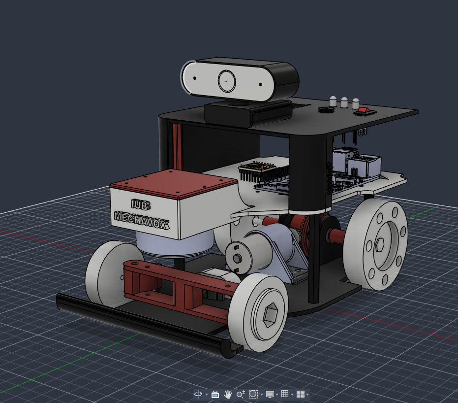
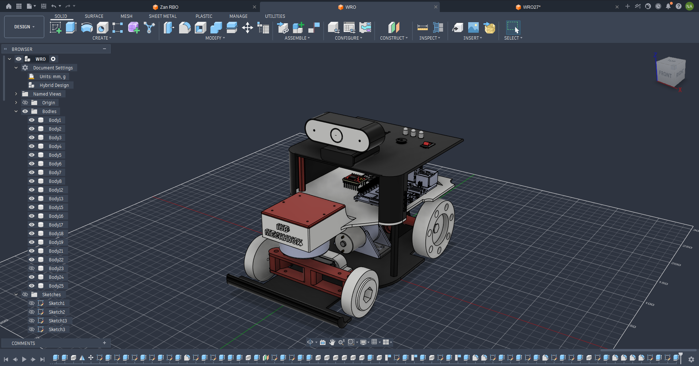
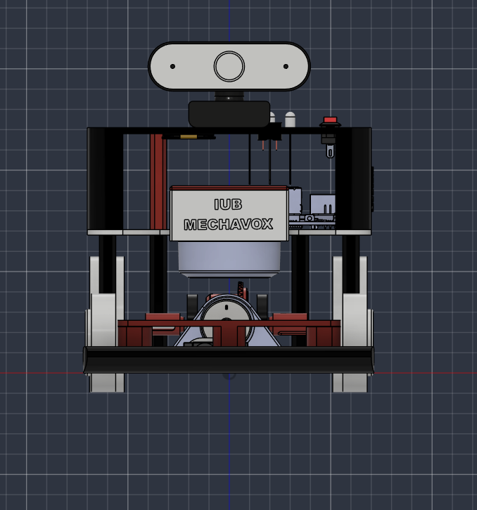
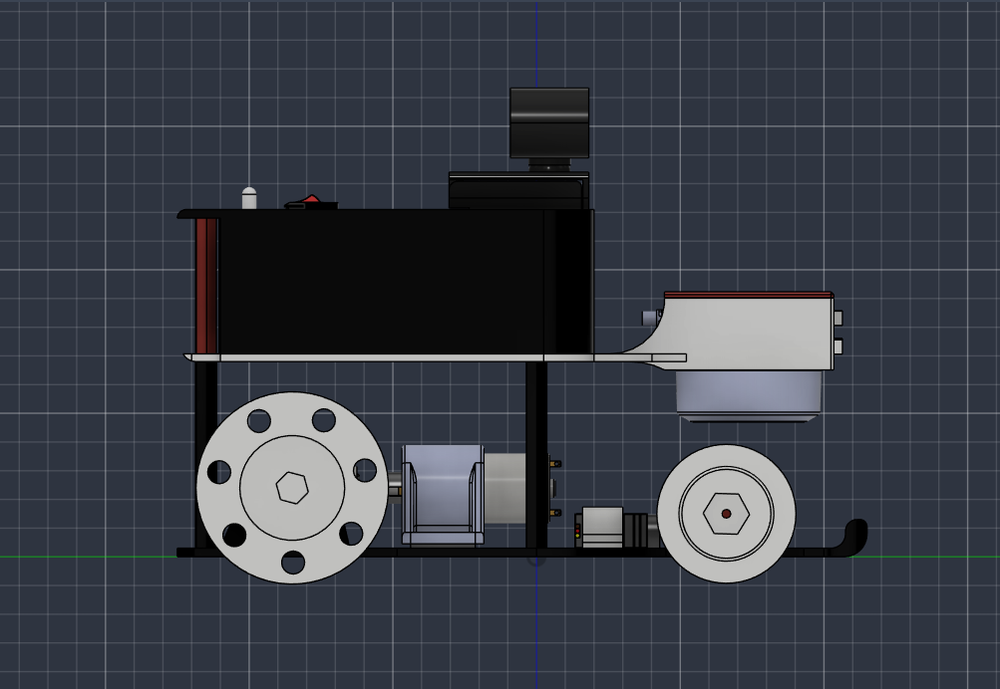

# IUB MECHAVOX — WRO 2027

<div align="center">



<br/>

[](https://wro-association.org)
[](https://www.autodesk.com/products/fusion-360)
[](https://github.com/ahlam26824/IUB-MECHAVOX-WRO2027)
[](LICENSE)

<br/>

### 🏆 World Robot Olympiad 2027 · Advanced Autonomous Robot

**[🌐 View 3D Model Online](https://ahlam26824.github.io/IUB-MECHAVOX-WRO2027/)** &nbsp;|&nbsp; **[⬇ Download .f3z File](WRO-2027-IUBMECHAVOX.f3z)** &nbsp;|&nbsp; **[🔬 Open in Autodesk Viewer](https://viewer.autodesk.com)**

</div>

---

## 📌 About

**IUB MECHAVOX** is an advanced autonomous robot designed by the IUB team for the **World Robot Olympiad (WRO) 2027**. The design prioritizes:

- ⚡ **Speed & Agility** — optimized low-profile chassis with precision wheels
- 🎯 **Sensor Accuracy** — front-mounted camera & proximity detection
- 🔩 **Modular Design** — easily swappable components via Fusion 360 archive
- 💡 **Aesthetic Engineering** — clean form factor with functional elegance

---

## 🗂 Repository Structure

```
IUB-MECHAVOX-WRO2027/
│
├── 📄 index.html                   ← Interactive 3D Viewer (web page)
├── 📦 WRO-2027-IUBMECHAVOX.f3z    ← Fusion 360 3D Model Archive
│
├── 📸 1stLOOK.png                  ← Hero render
├── 📸 2nslook.png                  ← Secondary render
├── 📸 frontsaide.png               ← Front view
├── 📸 LEFTside.png                 ← Left side view
└── 📸 WhatsApp Image ...jpeg       ← Team photo
```

---

## 🖥 3D Viewer

The repo includes a **live interactive 3D viewer** built with Three.js.

👉 **[Open Live Viewer →](https://ahlam26824.github.io/IUB-MECHAVOX-WRO2027/)**

Or open `index.html` locally in any browser.

**Controls:**
| Action | Input |
|--------|-------|
| 🔄 Rotate | Click + Drag |
| 🔍 Zoom   | Scroll Wheel |
| 📱 Mobile | Touch + Drag |

---

## 📷 Design Gallery

<div align="center">

| First Look | Second Look |
|:---:|:---:|
|  |  |

| Front Side | Left Side |
|:---:|:---:|
|  |  |

</div>

---

## 🛠 CAD File

| Property | Value |
|----------|-------|
| **Software** | Autodesk Fusion 360 |
| **Format** | `.f3z` (Fusion 360 Archive) |
| **File** | `WRO-2027-IUBMECHAVOX.f3z` |
| **Size** | ~19.9 MB |

To open the `.f3z` file:
1. Install [Autodesk Fusion 360](https://www.autodesk.com/products/fusion-360/free-trial) (free for students)
2. Go to **File → Open → Open from my computer**
3. Select `WRO-2027-IUBMECHAVOX.f3z`

---

## 👥 Team

**IUB MECHAVOX** — International University of Business Agriculture and Technology

> *"Engineering the future, one robot at a time."*

---

## ⭐ Support

If you like this project, please **star ⭐ the repository** — it means a lot to the team!

[](https://github.com/ahlam26824/IUB-MECHAVOX-WRO2027)

---

<div align="center">
Made with ❤️ by <b>IUB MECHAVOX</b> · WRO 2027
</div>
